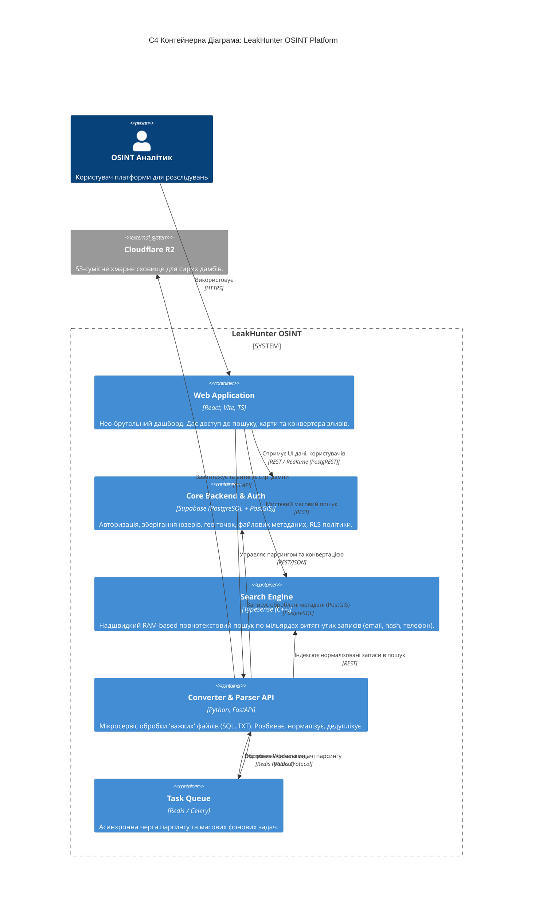

# Архітектура LeakHunter OSINT (C4 Model)

Цей документ описує високорівневу архітектуру повноцінної платформи з використанням сучасного AI/OSINT стеку: **React + Supabase + FastAPI + Typesense**.

## Контейнерна Діаграма (С4)

## Компоненти Системи

1. **Frontend (React + Vite)**: Базується на нео-бруталістичному UI. Відповідає за швидкий рендеринг, мапу через Leaflet/Mapbox та управління станом. 
2. **Core DB (Supabase)**: Зберігає конфіг, сесії користувачів через JWT та гео-просторові дані завдяки `PostGIS`.
3. **Data Pipeline (FastAPI)**: Цей шар потрібен для того, аби не "вішати" браузер чи Node.js. Скрипти на Python через `pandas/polars` "перетравлюють" гігабайтні SQL дампи, витягують хеші та мейли, і пакують їх у Typesense.
4. **Fast Search (Typesense)**: Оптимізована під оперативну пам'ять пошукова система, яка зможе видавати підказки (typo tolerance) при пошуку по мільярдах рядків витоків менш ніж за 50 мс.