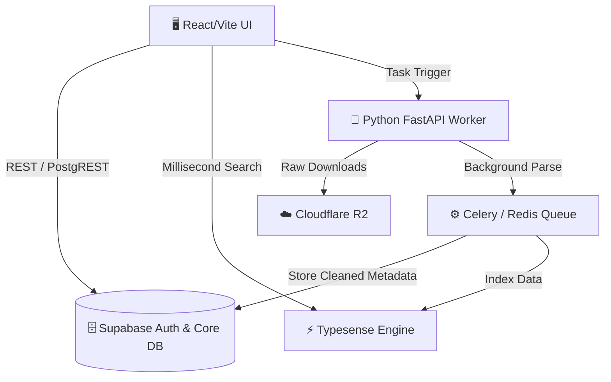

<div align="center">
  
# 🕵️‍♂️ LeakHunter OSINT UI

**High-Performance Neo-Brutalist Dashboard for OSINT Investigations**

[](https://react.dev/)
[](https://vitejs.dev/)
[](https://www.typescriptlang.org/)
[](#)

*Швидкий, мінімалістичний та готовий до масованого аналізу витоків даних (Data Leaks) фронтенд компонент.*

</div>

---

## 📌 Огляд Проєкту

Цей репозиторій містить **високопродуктивний Frontend UI**, який розділений на потужні незалежні модулі:

*   📊 **Дашборд:** Моніторинг активних баз, лайв-сповіщення та статистика.
*   🌍 **GeoExtract:** Карта для злиття координат із розширеним таймлайном подій та фільтрацією "свіжих/старих" слідів.
*   🔄 **Конвертер & Дедуплікатор:** Інтерфейс для мапінгу та створення структурованих JSON зі сирих SQL/TXT дампів.

## 🏗 Архітектура (High-Level)

Проєкт підготовлений до переходу на повноцінний **Microservices Stack**. Нижче наведена схема архітектури (Mermaid):



### Додаткова документація:
- 📖 [**ARCHITECTURE.md**](./ARCHITECTURE.md) — Детальна C4 контейнерна діаграма повного стеку.
- 🚀 [**DEPLOYMENT.md**](./DEPLOYMENT.md) — Покрокова інструкція з локального налаштування Docker-середовища та розгортання в Production.

## 💻 Tech Stack (UI Foundation)

*   **Core:** React 19 + TypeScript + Vite
*   **Styling:** Neo-Brutalism Design System (Custom CSS Variables, High Contrast)
*   **Icons:** Lucide-React
*   **Performance:** Lazy loading (`React.lazy`), Chunk splitting, Component modularity.

## 🛠 Запуск в Dev-режимі

Запустіть платформу локально всього у три кроки:

```bash
# 1. Клонування репозиторію
git clone https://github.com/wakkawarpman-oss/leakhunter-osint-ui.git
cd leakhunter-osint-ui

# 2. Встановлення залежностей 
npm install

# 3. Запуск дев-сервера з HMR
npm run dev

# Для збірки під Production виконайте:
npm run build
```

---
<div align="center">
  <i>Розроблено для OSINT-аналітиків, які цінують швидкість та читабельність даних.</i>
</div>
