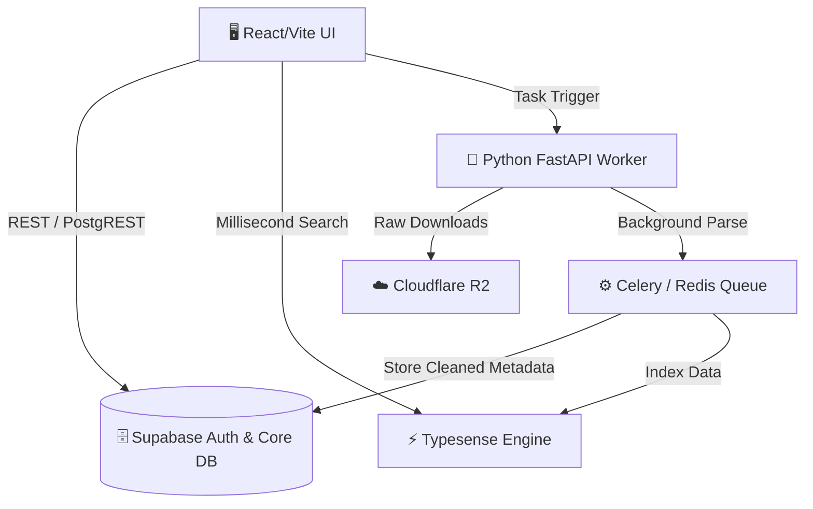

<div align="center">
  
# 🕵️‍♂️ LeakHunter OSINT UI

**High-Performance Neo-Brutalist Dashboard for OSINT Investigations**

[](https://react.dev/)
[](https://vitejs.dev/)
[](https://www.typescriptlang.org/)

*Швидкий, мінімалістичний та готовий до масованого аналізу витоків даних (Data Leaks) фронтенд компонент.*

<!-- Тут можна додати скріншот:  -->

</div>

---

## 📌 Детальний Опис Функцій Платформи

LeakHunter Frontend забезпечує інтерфейс для складної OSINT-архітектури. Кожен модуль спроєктований так, щоб витримувати великі масиви даних та полегшувати роботу аналітика.

### 📊 1. Сенсорна Панель (Dashboard)
Головний екран моніторингу активності розслідувань.
- **Лайв-моніторинг витоків:** Миттєвий перегляд нових записів, підтягнутих з DarkWeb, Telegram-каналів або публічних форумів.
- **Health-метрики:** Віджет "Стан конвеєра", що показує завантаженість серверів обробки (Парсинг → Дедуплікатор → Доставка).
- **Прямі сповіщення:** Інтерактивна таблиця, яка автоматично маркує загрози бейджами (*Висока - червоний*, *Середня - жовтий*, *Низька - зелений*) для швидкого реагування.

### 🌍 2. Картографія GeoExtract
Модуль для перетворення сирих логів або медіафайлів на фізичні координати на карті.
- **Фонові обчислення:** Панель для перетягування документів (PDF, XLSX) або RAW-фотографій з метою вилучення координат.
- **Інтерактивна нео-радарна карта:** Усі виявлені точки відображаються на контрастній оливковій сітці без необхідності зовнішніх API-ключів для відображення карт.
- **Хронологічний таймлайн:** Маркери поділяються за строком давності:
  - 🔴 **Свіжі координати** (< 24 годин): Яскраві пульсуючі маркери.
  - 🟡 **Середня давність** (1-3 дні): Жовті маркери.
  - 🟠 **Старі (Heatmap)** (3-7 днів): Точки перетворюються на розмитий тепловий слід, щоб не захаращувати екран, але вказувати на загальну тенденцію локації.

### 🔄 3. Парсер та Конвертер Зливів
Інструмент для попереднього очищення величезних дампів баз даних перед відправкою у пошукову систему (Typesense).
- **RAW Input:** Робоча область для вводу фрагментів SQL-дампів, JSON чи неструктурованих Combo-листів.
- **Шаблони екстракції:** Вибір готового профілю (наприклад, "User DB"), який автоматично знайде поля *Email*, *Телефон* та *Хеш пароля*.
- **Pre-Processing опції:** Перемикачі для швидкого "Видалення дублікатів", "Нормалізації номерів" та "Валідації Email" прямо "на льоту".

### 🔎 4. Дедуплікатор і Масовий Пошук (Roadmap)
Функціонал, підготовлений на рівні UI, який буде "оживлений" після підключення C++ пошукових движків. Дозволить "пробивати" сотні email-ів чи хешів одночасно з експортом результатів у CSV/Excel.

---

## 🏗 Архітектура (High-Level)

Проєкт підготовлений до переходу на повноцінний **Microservices Stack**. Нижче наведена схема архітектури (Mermaid):



### Додаткова документація:
- 📖 [**ARCHITECTURE.md**](./ARCHITECTURE.md) — Детальна C4 контейнерна діаграма повного стеку.
- 🚀 [**DEPLOYMENT.md**](./DEPLOYMENT.md) — Покрокова інструкція з локального налаштування Docker-середовища та розгортання в Production.

---

## 💻 Tech Stack (UI Foundation)

*   **Core:** React 19 + TypeScript + Vite
*   **Styling:** Neo-Brutalism Design System (Custom CSS Variables, High Contrast)
*   **Icons:** Lucide-React
*   **Performance:** Lazy loading (`React.lazy`), Chunk splitting, Component modularity.

## 🛠 Запуск в Dev-режимі

Запустіть платформу локально всього у три кроки:

```bash
# 1. Клонування репозиторію
git clone https://github.com/wakkawarpman-oss/leakhunter-osint-ui.git
cd leakhunter-osint-ui

# 2. Встановлення залежностей 
npm install

# 3. Запуск дев-сервера з HMR
npm run dev

# Для збірки під Production виконайте:
npm run build
```
